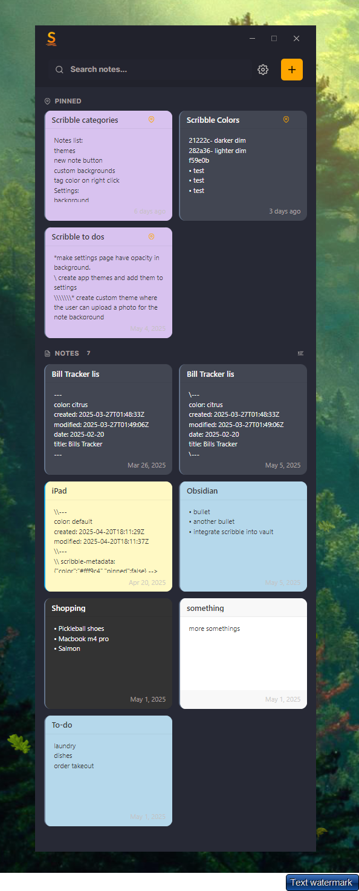

# 📝 Scribble


**Scribble** is a free, privacy-focused markdown sticky notes app that puts you in complete control of your data. Create, organize, and access your notes with a clean, modern interface while keeping all your information stored locally on your computer.

<div align="center">
  
</div>

## ✨ Why Scribble?

Scribble combines the simplicity of sticky notes with the power of markdown, all while respecting your privacy:

- **🔒 Your Data, Your Control** - All notes are saved locally on your computer with no cloud sync or data collection
- **📋 Markdown-Based** - Write in markdown for powerful formatting with minimal effort
- **🌓 Multiple Themes** - Choose between Light, Dark, and Dim modes to suit your preference
- **⚡ Fast & Lightweight** - Opens instantly and uses minimal system resources
- **🧩 Works with Obsidian** - Save notes in your Obsidian vault for seamless integration
- **💯 Completely Free** - No subscriptions, no hidden costs, no premium features

## 🚀 Key Features

- **Multi-window Support** - Create and edit notes in separate windows for better multitasking
- **Rich Markdown Editing** - Format text with headings, lists, code blocks, links, and more
- **Auto-save** - Never lose your work with automatic saving as you type
- **Customizable Notes** - Choose different colors for better organization
- **Custom Save Location** - Select where to store your notes on your computer
- **Global Hotkeys** - Create new notes or access the app quickly with keyboard shortcuts
- **System Tray Integration** - Keep Scribble readily available while staying out of your way

## 💡 Use Cases

Scribble is perfect for:

- **Quick Capture** - Jot down ideas, thoughts, and information without interrupting your workflow
- **Meeting Notes** - Take notes during meetings with markdown formatting for clarity
- **Task Management** - Create quick to-do lists with markdown checkboxes
- **Code Snippets** - Save and format code snippets with syntax highlighting
- **Research Collection** - Gather information and organize it with markdown structure
- **Obsidian Companion** - Use alongside Obsidian for quick notes that become part of your knowledge base

## 🔄 Obsidian Integration

Scribble works beautifully with [Obsidian](https://obsidian.md) by:

- Using the same markdown format that Obsidian understands
- Allowing you to save notes directly to your Obsidian vault
- Providing a lightweight, quick-access alternative for capturing thoughts that can later be organized in Obsidian
- Creating standard markdown (.md) files that are fully compatible with Obsidian's features

## 🖥️ Supported Platforms

- Windows
- macOS
- Linux

## 📥 Installation

*Download links coming soon*

For now, you can build from source:

1. Clone the repository
2. Install dependencies with `npm install` or `bun install`
3. Start the app with `npm run dev` or `bun run dev`

## 🛠️ For Developers

### Tech Stack

Scribble is built with modern technologies:

- **Electron** - Cross-platform desktop framework
- **React** - UI library with TypeScript
- **TipTap** - Rich text editor with markdown support
- **Tailwind CSS** - Utility-first CSS framework
- **Vite** - Next generation frontend tooling

### Getting Started

Prerequisites:
- Node.js (v18 or higher)
- npm, yarn, or bun

```bash
# Clone the repository
git clone https://github.com/TylerPBurnett/Scribble.git
cd Scribble

# Install dependencies
npm install
# or
bun install

# Start the development server
npm run dev
# or
bun run dev
```

### Building

```bash
npm run build
# or
bun run build
```

This will create platform-specific installers in the `release` directory.

## 🤝 Contributing

Contributions are welcome! Feel free to submit issues or pull requests.

## 📄 License

[MIT](LICENSE) - Free to use, modify, and distribute.
